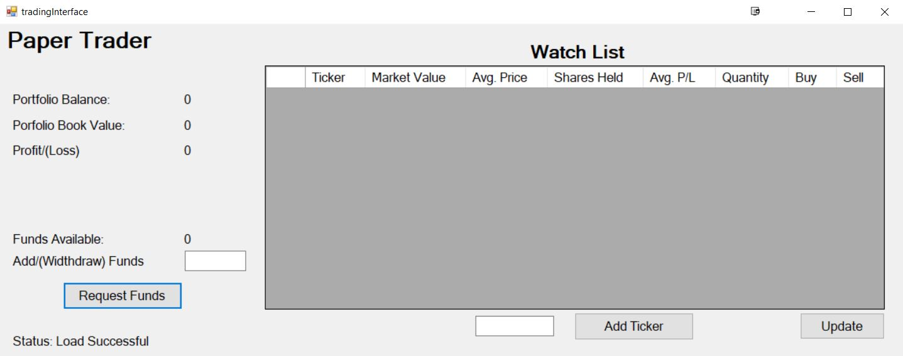
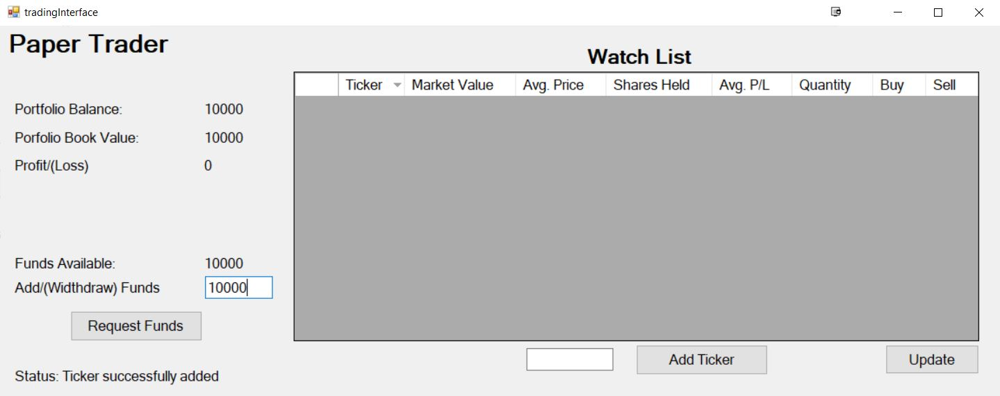
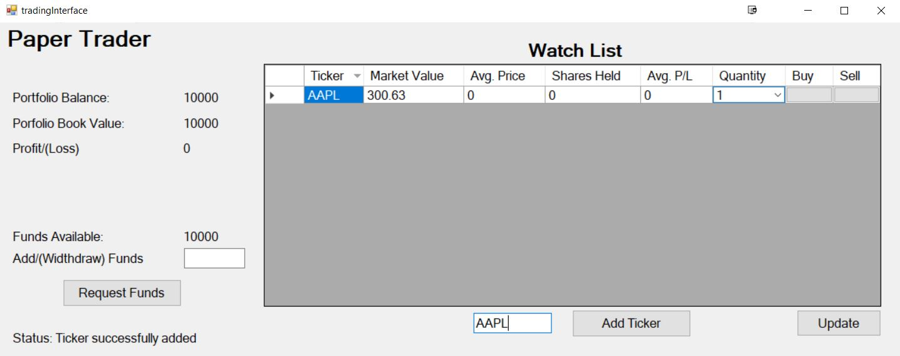
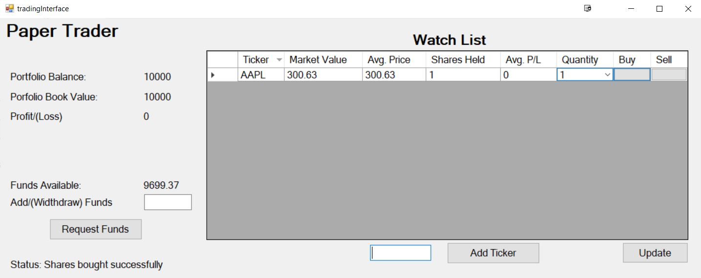
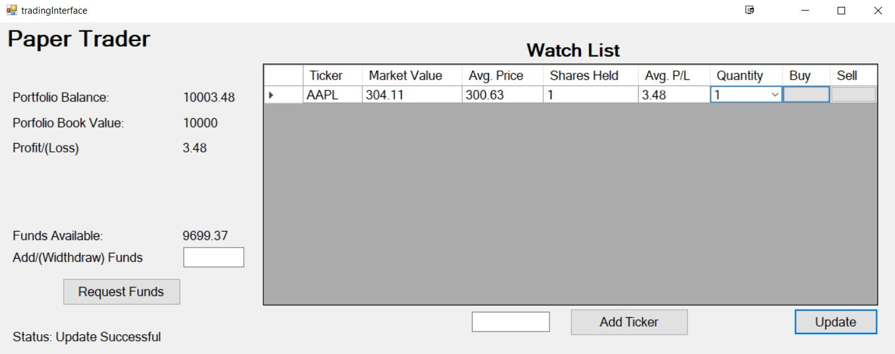
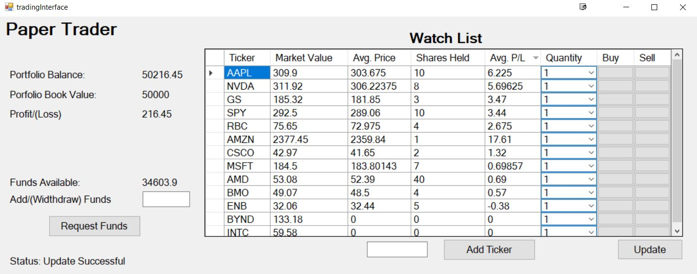

# paperTrader

A paper trading application that simulates the stock market experience. Users can add (artificial) funds to their account, invest in equities, and track their profit/loss.

## Initialization

Upon opening the application data will be loaded from the SaveData.txt file populating the form. When opening the application for the first time the following will be displayed.

  
## Adding/Withdrawing funds

Funds can be added to the account by typing an amount into the ‘Add/(Withdraw) Funds’ input box, and clicking the ‘Request Funds’ button.

Note: Funds can be withdrawn by entering a negative number. Withdrawing funds simply reduces the amount of funds available.

## Adding Ticker symbols

A company can be added to the watch list by typing the associated ticker symbol in the input box, and clicking the ‘Add Ticker’ button.

  
Upon adding a new company to the watch list, market data for all other companies in the list will be updated (updating explained below). If a symbol already exists in the watch list it will not be added. If the symbol is invalid or delisted the market value will be set to 0. 

Note: A company can be removed from the watch list by selecting the entire row and pressing the delete key.

## Buying/Selling Shares

Once a ticker symbol has been added, shares can be Shares can be purchased/sold.

To purchase shares, select the desired quantity and click the corresponding ‘Buy’ button. If the market price of the shares exceeds the amount of funds available, the order will not be placed.

  
To sell shares, select the desired quantity and click the corresponding ‘Sell’ button. If the quantity of shares being sold exceeds the shares held, the order will not be placed.

## Updating

An update can be forced by clicking the “Update” button. On update, the total profit/loss of the portfolio will be updated to reflect fluctuations in market prices.

  
Note: An update will automatically occur when adding a new a company to the watch list to keep market data in sync.

When an update occurs, the GetData.py script will be called, pulling the market data for all companies in the watch list, and storing current share prices in the Data.txt file. Subsequently, the data is imported into the watch list to prevent corruption.

## Saving Data

Data is saved after adding funds/ticker symbols, placing buy/sell orders, and when closing the form. you’ll never forget your gains!

## Example

An example portfolio data after 1 day of trading.

